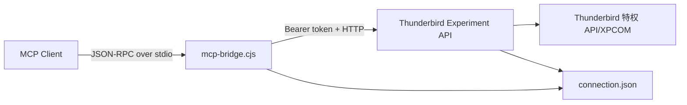

# 第三方源码研究

## 研究意图

本项目借鉴 `thunderbird-mcp` 已验证的 Thunderbird 特权扩展、本地发现和失败关闭经验，但切断 MCP 层。研究目标不是改造或兼容该项目，而是确认哪些本机通信与安全机制值得重新设计为专用 CLI 协议。

## 研究范围与事实基线

本机研究对象为 `$PROJ_DIR_THIRD/thunderbird-mcp`，版本 `0.7.4`，HEAD `41c73ae`。研究期间未修改第三方工作区。

| 文件 | 核对内容 |
|---|---|
| `package.json` | `thunderbird-mcp` 可执行入口、版本与运行时约束 |
| `mcp-bridge.cjs` | stdio JSON-RPC、连接发现、HTTP 转发、附件路径读取 |
| `extension/manifest.json` | Manifest V2、权限、Experiment API、最低 Thunderbird 版本 |
| `extension/background.js` | 扩展启动时启动本地服务 |
| `extension/mcp_server/api.js` | HTTP server、session token、connection file、工具分发与权限校验 |
| `extension/httpd.sys.mjs` | Mozilla 特权环境中的 HTTP server 实现与许可证边界 |
| `SECURITY.md` | stdio、loopback、特权扩展三层信任边界 |
| `test/*.test.cjs` | 认证、权限、参数验证、连接刷新、协议与压力测试 |

## 已确认架构

- bridge 是常驻 MCP server 进程，处理 `initialize`、`ping`、`resources/list`、`prompts/list` 等生命周期或空集合响应。
- `tools/call` 通过 `127.0.0.1` HTTP 转发给扩展。
- 扩展默认尝试端口 `8765` 至 `8774`，启动时生成 32 字节随机 token。
- connection file 包含 `port`、`token`、`pid`；目录目标权限为 `0700`，文件为 `0600`。
- bridge 会扫描普通临时目录、macOS `/var/folders`、Snap 和 Flatpak 位置，并按新鲜度尝试候选。
- 扩展运行于 Experiment API/XPCOM 特权边界，认证或授权缺陷可直接扩大为邮箱数据访问。

## 可借鉴的设计

| 能力 | 借鉴方式 |
|---|---|
| 动态端口发现 | 保留，但 descriptor 改为多实例、版本化结构 |
| 启动期随机 token | 保留 256-bit 随机会话凭据，移除稳定 token 选项 |
| 文件权限 | 保留目录 `0700`、文件 `0600`、symlink 拒绝与原子写入 |
| 陈旧发现信息自愈 | 保留周期校验、进程退出清理与 CLI 端 stale detection |
| 候选发现 | 保留 macOS 临时目录差异的经验，缩小为可信根目录和显式 override |
| 认证优先 | 所有错误细节、路由和业务参数解析前先认证 |
| 账号 allowlist | 保留扩展侧强制作用域，配置损坏时失败关闭 |
| 参数 allowlist | 每个 endpoint 使用严格 schema，拒绝未知字段和继承属性 |
| 身份选择 | 发件身份只能来自 Thunderbird 当前 profile 已配置 identity |
| 附件保护 | 保留 symlink、敏感路径、数量、单项与总量限制 |
| 草稿优先 | 保留 review-first 思路，升级为 CLI 与 Skill 双层规则 |
| 可逆删除 | 默认移入 Trash，不把永久删除纳入 MVP |

## 必须排除的设计

| 排除项 | 原因 |
|---|---|
| MCP server 注册 | 会引入常驻工具面和固定上下文成本 |
| JSON-RPC envelope | 本项目使用稳定领域 CLI 和版本化本地 HTTP contract |
| stdio bridge | CLI 是一次性调用者，不维护 MCP 消息循环 |
| `initialize`、`ping` | 不继承 MCP 生命周期；健康检查使用 `GET /v1/status` |
| `tools/list`、`tools/call` | 不提供动态工具枚举或通用工具分发入口 |
| 40 个工具 schema | 仅为当前命令解析所需 schema 付出上下文与运行成本 |
| listen-all | 服务只能绑定数值回环地址 `127.0.0.1` |
| stable auth token | 与“每次扩展启动生成短期凭据”的目标冲突 |
| 单个固定 `connection.json` | 多 profile/多实例会覆盖或误连 |
| bridge 读取任意附件路径 | 新 CLI 只接受经策略验证的输入文件，并尽量由 Thunderbird UI 选择 |
| `skipReview` 类普通布尔开关 | 外发确认不可由通用 flag 静默绕过 |

## 发现的安全缺口与改进

第三方实现未显示完整的 `Host` 精确 allowlist 和 `Origin` 校验，并存在 listen-all 与稳定 token 配置。新设计将：

1. 只绑定 `127.0.0.1`，不解析 `localhost`，不接受 IPv4/IPv6 任意地址。
2. 精确验证 `Host: 127.0.0.1:<descriptor-port>`。
3. CLI 请求默认不带 `Origin`；扩展拒绝浏览器来源的非空或非明确允许 Origin。
4. Bearer token 之外还验证协议版本、client kind、request ID、时间窗口和一次性 nonce。
5. descriptor 按实例分文件，不从世界可写目录中的任意路径盲目信任内容。
6. 认证失败统一返回最小错误，不暴露 endpoint、版本、profile 或账号信息。

## 许可证边界

当前项目只记录设计事实，没有复制第三方源码。若后续复用 Mozilla `httpd.sys.mjs` 或其他 MPL-2.0 文件，必须：

- 在文件级保留原许可证与版权声明。
- 公开该 MPL 文件及修改内容的源代码。
- 在发布包中提供 NOTICE/许可证信息。
- 不把“接口思想借鉴”误记为“源码可无条件复制”。

## 研究结论

技术上最可行的路径是保留“Thunderbird 特权扩展 + loopback 服务 +受保护 descriptor”的核心，但用专用、窄、版本化的 CLI API 替代 MCP bridge。安全基线必须比研究对象更严格，尤其是多实例、Host/Origin、防重放和稳定 token 方面。

## 0.3.0 邮件能力 compatibility spike（2026-07-27）

### 意图

在冻结全部邮件 route 的共享契约（`src/contracts/routes.ts`）并扩出 Experiment 特权桥的路由骨架之前，先确认两件事：(1) 本机可用的 Thunderbird 与文档假设基线是否一致；(2) `extension/bridge/api.js` 现有的 loopback server / 认证 / 防重放管线是否可以在不改变其行为契约的前提下，安全地扩展出一条通用的邮件 route 分发管线。

### 环境事实

本机（hangox-mbp-m5）已安装 `/Applications/Thunderbird.app`，`thunderbird --version` 报告 **Mozilla Thunderbird 153.0**（`CFBundleVersion 15326.7.17`）。docs/09、docs/10 中记录的兼容基线假设是 “Thunderbird 128 ESR + 当前 ESR + 当前 release”；本机实际安装的是当前 release 通道的 153.0，**不是** 128 ESR。docs/02 已经把 `nsIServerSocket.LoopbackOnly` 的可用性验证记为“Thunderbird 153 已验证”，与本机版本一致，因此本轮延续该结论，但 **128 ESR 本身尚未在任何机器上实测**，这一项差距原样保留为未解除的 P0 前提（docs/10 表格），不因本轮工作而视为已解除。

### 本轮实际验证方式与范围

本轮属于隔离环境下的骨架/契约验证，**没有**启动真实 Thunderbird GUI 走完整的人工配对确认流程——原因有二：一是本会话没有可用于安全点击原生确认对话框的交互式桌面权限（与 docs 中“UI confirm 因 Dexter 权限不可用而环境未验证”是同一类限制，见 docs/07、docs/09 的“环境未验证”记法）；二是本轮范围本身就是“契约冻结 + 传输/Experiment 特权桥骨架”，不产出任何真实 mail adapter 代码，没有可供人工确认的实际邮件操作可测。

实际执行的验证是**执行级**而非源码字符串断言：复用仓库既有的 `test/helpers/experiment-harness.mjs`，把改动后的 `extension/bridge/api.js` 原样在 Node VM 中跑起来，用合成 HTTP/1.1 报文与真实 Ed25519 签名驱动其内部真实的 `preflight`/`dispatch` 闭包（细节见 `test/experiment-handler.test.mjs` 中已有的 89 项用例，全部保持通过）。这证明了：

- 新增的邮件 route 通用分发分支（capability 校验 → Content-Type/body 硬上限 → JSON 解析 → 反原型污染守卫 → handler 调用）可以插入现有 `preflight`/`dispatch` 而不改变 `/v1/status`、`/v1/pairing/intents` 既有路径的任何可观察行为（含精确错误码、409/426 语义、epoch 竞态窗口处理）。
- 未知路径（如 `/v1/unknown`）依旧落在原有的 `route 不允许` fallback，新增分支不会误吞验证。
- 未配对状态下访问任意邮件 route 必然因 `verifySignature(request, null)` 恒为 `false` 而 401 失败关闭，不需要额外的空指针判断。

**未验证（环境未验证 / environment-blocked）**：真实 Thunderbird（128 ESR 或 153.0）加载该 XPI 后，Experiment API 的 `nsIServerSocket`/`ExtensionCommon.ExtensionAPI` 生命周期、以及未来 mail adapter 将要使用的标准 MailExtension API（`accounts`/`folders`/`messages`/`compose` 等）在真实进程中的可用性与权限提示，本轮未做真机验证；这与 docs/09 已经记录的“环境未验证”项属于同一类型，不是本轮新增的缺口。

### 邮件 API 可行性结论（供 E2/E3/E4 参考，非本轮实现）

Thunderbird 稳定 MailExtension API（`browser.accounts`、`browser.folders`、`browser.messages`（含 `query`/`get`/`update`/`move`/`listAttachments`/`getAttachmentFile`，**不含** `delete`——永久删除本轮范围裁决排除）、`browser.compose`、`browser.identities`）覆盖本轮契约里绝大多数只读/可逆/草稿能力，理论上不需要在 `bridge/api.js` 里为它们各自新写 XPCOM 代码，只需要在 **非特权** MV3 background 侧调用这些 API 并通过特权桥转发结果；这与 `docs/04-extension-design.md` 权限表中“accountsRead/messagesRead/accountsFolders/messagesMove/compose”的既定权限分级一致。真正需要留在 Experiment/XPCOM 特权层的只有：loopback HTTP server 本身（已实现）、Ed25519 签名与 opaque ref 绑定表（本轮已实现，见 `extension/bridge/api.js` 新增的 `createRefStore`）。这一结论未经真机验证，留给实现只读/可逆/草稿能力的后续 PR 在隔离 profile 中复核。

**范围裁决（team-lead，2026-07-27）**：v0.3.0 不实现永久删除（`message delete`）、长连接/轮询式 `watch`、`calendar`。本轮已从 `src/contracts/routes.ts`、`extension/bridge/api.js`、`extension/src/background.ts` 的登记表中移除这三类的 route/handler 骨架，不申请 `messagesDelete` 或任何 calendar 相关权限；`message delete` 与 `watch` 在 `src/contracts/commands.ts` 中保持 `phase: "future"`，对应 CLI 命令继续落到既有的 `E_NOT_IMPLEMENTED` 兜底。永久删除若未来实现，仍必须是 prepare/confirm 两阶段并绑定 Thunderbird UI 人工确认回执，不接受 `--force`/`--yes`；这是独立评审范围，不在本轮内。

### 本轮结论

可以在不破坏 Phase 1 已验证行为契约的前提下，安全地冻结全部邮件能力的 route/capability/opaque ref 契约并搭好 Experiment 特权桥的通用分发骨架；128 ESR 真机验证与真实 GUI 人工确认链路仍是未解除的前提，不应被本轮的执行级测试通过误读为“已在真实 Thunderbird 中验证”。
