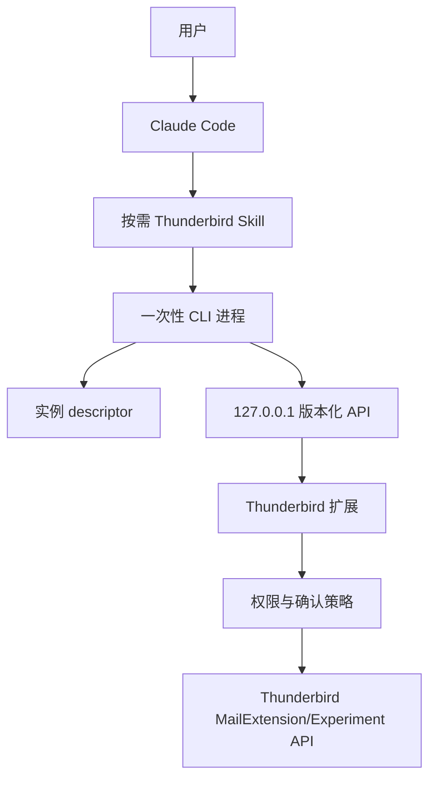

# 总体架构与传输

## 设计意图

系统把 Claude 的推理、CLI 的确定性策略和 Thunderbird 的邮箱权限分开：Claude 只表达用户意图，CLI 负责契约与安全门禁，扩展是唯一能访问 Thunderbird 数据的组件。任何一层都不能凭自身绕过外发确认或账号作用域。

## 组件边界



| 组件 | 负责 | 不负责 |
|---|---|---|
| Skill | 触发判断、工作流、最小上下文、安全提示 | 邮箱凭据、底层网络、业务状态持久化 |
| CLI | 参数解析、输入文件、发现、认证、重试、输出压缩、双层确认 | IMAP/SMTP/OAuth、直接访问 profile 数据库 |
| 扩展 | Thunderbird API、账号授权、严格验证、审计、最终策略裁决 | Claude 推理、MCP、远程服务 |
| Thunderbird | 账号身份、邮件同步、撰写 UI、系统权限 | CLI token 持久化 |

## 传输选型

### MVP：数值回环 HTTP/1.1

选用扩展内 HTTP server，只绑定 `127.0.0.1` 随机高位端口。接口语义按 HTTPS 风格设计——认证、重放防护、最小错误和版本握手——但实际链路为本机 HTTP/1.1，因为证书生成、信任与轮换会显著增加本机安装复杂度。

选择原因：

- Thunderbird 153 Experiment/XPCOM 环境已验证可用 `nsIServerSocket.LoopbackOnly` 实现受限 listener；不采用会在 handler 前缓冲完整 body 的 `httpd.sys.mjs`。
- CLI 可使用 Node 原生 `http`，无需常驻 helper。
- 动态端口能支持并行 profile，只要 descriptor 不采用单文件覆盖。
- 请求/响应边界便于设置 body、并发、超时和 Content-Type 限制。

### 不选 WebExtension Native Messaging 作为 MVP

Native Messaging 需要额外安装 host manifest 和固定 native host 程序，扩展与 CLI 的部署生命周期更复杂；它适合未来作为强化 transport，而非最小可交付路径。

### Unix domain socket 作为后续评估项

Unix socket 可减少浏览器跨源/DNS rebinding 面，但 Thunderbird 特权扩展端的跨版本可实现性、路径长度、沙箱目录和签名发布需单独验证。协议层保持 transport-independent，以便未来替换。

## Endpoint 形态

禁止通用 `callTool(name,args)`。每个操作具有稳定 method、path 与 schema：

```text
GET  /v1/status
GET  /v1/accounts
GET  /v1/folders
POST /v1/messages/search
GET  /v1/messages/{messageRef}
POST /v1/drafts
PATCH /v1/drafts/{draftRef}
POST /v1/drafts/{draftRef}/open
POST /v1/drafts/{draftRef}/send-intent
POST /v1/drafts/{draftRef}/send-confirm
```

扩展必须返回统一协议 envelope，但 CLI 对外使用独立的 CLI envelope，避免把内部 transport 字段泄漏为永久公共契约。

## 请求安全头

每个请求至少包含：

```text
Host: 127.0.0.1:<port>
Authorization: Bearer <session-token>
Content-Type: application/json
X-Thunderbird-Client: thunderbird-skill-cli
X-Thunderbird-Protocol: 1
X-Thunderbird-Client-Version: 0.3.0
X-Thunderbird-Pairing-Epoch: <strict-decimal-epoch>
X-Request-Id: <uuid>
X-Request-Timestamp: <unix-ms>
X-Request-Nonce: <random-128-bit>
```

扩展验证顺序：

1. socket 的本地地址必须是 `127.0.0.1`。
2. `Host` 与当前监听端口精确相等。
3. 拒绝非空且不在明确 allowlist 的 `Origin`。
4. 在读取完整 body 前限制请求行、header、Content-Length，并拒绝重复 header 与 `Transfer-Encoding`。
5. 在读取完整 body 前验证 token，使用 constant-time comparison。
6. 在读取完整 body 前验证协议、时间窗口、未使用 nonce及 paired client 签名。
7. 对每个连接执行 1500 ms 绝对 deadline；header 和 Phase 1 JSON body 上限均为 16 KiB。
8. 使用 fatal UTF-8 解码，解析 JSON 并执行严格 schema validation。
9. 检查对象、命令与风险策略，输出统一、最小的 JSON 响应后关闭连接。

## 发现文件

每个实例独立写入 descriptor：

```json
{
  "descriptorVersion": 2,
  "protocolVersion": 1,
  "instanceId": "inst_...",
  "profileId": "sha256:...",
  "profileLabel": "Default",
  "pid": 12345,
  "port": 49152,
  "sessionToken": "64-hex-characters",
  "extensionVersion": "0.3.0",
  "pairingEpoch": "0",
  "startedAt": "2026-07-24T12:00:00Z",
  "expiresAt": "2026-07-24T20:00:00Z"
}
```

推荐目录：

```text
$TMPDIR/thunderbird-skill-cli/
├── instances/
│   ├── inst_a.json
│   └── inst_b.json
└── active.json
```

约束：

- 根目录和 `instances/` 为当前用户拥有、权限 `0700`、非 symlink。
- descriptor 为 `0600`，通过 `nsISafeOutputStream.finish()` 在同目录原子替换；正常 shutdown 直接清理，异常退出由 parent-PID watchdog 兜底。watchdog 在父进程退出后使用系统 plist/JSON 解析器读取当前文件的 `instanceId`，仅在仍属于原实例时删除，因此既能覆盖原子替换导致的 inode 变化，也不会误删被其他实例替换的文件。
- `active.json` 只是提示，不是信任根；CLI 必须验证 PID、端口、token 和 status 握手。
- 环境变量 override 仅允许绝对路径，并执行相同权限与 owner 检查。
- 多个健康候选且用户未指定目标时返回 `E_AMBIGUOUS_INSTANCE`。

## 版本握手

`GET /v1/status` 返回：

- `protocolVersion`
- `minCliVersion` / `maxCliVersion`
- `extensionVersion`
- `instanceId`
- `profileId`
- `capabilities`
- `pairingState`
- `pairingEpoch`
- `authorizedAccountIds` 的脱敏标识

不提供动态命令 schema；`capabilities` 只表示版本化能力标识，例如 `mail.read.v1`、`draft.write.v1`。CLI 遇到协议主版本不兼容时返回 `E_VERSION_MISMATCH`，不得猜测降级。

## 超时、重试与幂等

- 连接超时：2 秒；普通读取总超时：15 秒；大正文/附件：30 秒。
- 只读请求可对“连接拒绝/descriptor 过期”重新发现后重试一次。
- 写操作默认不自动重试，除非带唯一 `Idempotency-Key` 且扩展返回可证明未执行。
- 扩展缓存幂等键及结果摘要，保留时间建议 10 分钟。
- CLI 不在 401/403 后循环尝试不同 token，重新发现最多一次后失败。

## 数据限制

| 项目 | MVP 默认 | 硬上限建议 |
|---|---:|---:|
| JSON request | 1 MiB | 4 MiB |
| JSON response | 4 MiB | 16 MiB |
| 搜索条数 | 20 | 100 |
| 正文内联文本 | 64 KiB | 256 KiB |
| 单附件输入 | 10 MiB | 25 MiB |
| 一次附件总量 | 20 MiB | 50 MiB |
| 并发请求 | 4 | 8 |

超过内联限制时返回截断元数据、分页 cursor 或权限受控的临时文件引用，不返回不受控 base64。

## macOS 约束

- `$TMPDIR` 可能位于 `/var/folders/...`，不同启动方式可观察到不同临时目录。
- Thunderbird、终端和 CLI 可能受 TCC、App Sandbox 或受保护目录权限影响。
- CLI 不假设能读取 Thunderbird profile 文件；所有邮箱访问必须经扩展。
- 附件从 CLI 传入时，先在 CLI 可见空间验证；扩展看不到路径时应改为有限大小的流式上传，而不是让扩展读取任意文件路径。
- 发布前需在普通安装、开发者临时扩展、签名 XPI、多个 Thunderbird profile 下验证路径行为。

## 明确决策与未决项

| 类型 | 内容 |
|---|---|
| 已决 | MVP 使用 `127.0.0.1` HTTP/1.1 + 每实例 descriptor |
| 已决 | Thunderbird 153 使用 `nsIServerSocket.LoopbackOnly` + 自建有限 parser；`httpd.sys.mjs` 因 handler 前 body 缓冲不满足慢滴安全门槛 |
| 已决 | 不支持 listen-all、稳定 token、MCP 兼容入口 |
| 已决 | CLI 与扩展都执行完整验证与风险策略 |
| 已决 | `protocolVersion=1` + Ed25519；`descriptorVersion=2`（新增 `pairingEpoch`），两者独立演进 |
| 已决 | canonical request 覆盖 `pairingEpoch`；canonical 变更靠 CLI/扩展版本兼容握手提前给出 `E_VERSION_MISMATCH`，不 bump `protocolVersion` |
| 已接受残余风险 | 同一 macOS 用户会话内的恶意进程 out-of-scope；Ed25519 + Keychain 不证明调用进程身份，仅证明持有私钥的实体 |
| 环境未验证 | 固定 intent UI confirm → receipt → signed status/doctor 的真实 GUI 链路（Dexter 权限不可用）|
| 未决 | Thunderbird 128 ESR、签名扩展审核与发布渠道兼容性 |
| 未决 | macOS sandbox 下附件流式传输实现 |

## 威胁模型与残余风险

同一 macOS 用户会话内的恶意进程是**明确 out-of-scope 的已接受残余风险**；Ed25519 + macOS Keychain **不能**证明调用进程身份（同用户进程可读取该私钥），只能证明请求由持有该私钥的实体产生。仍然真实防御的攻击面包括：网页访问本地回环、descriptor 替换、请求重放、被动 token 泄漏与用户误操作；Phase 2 起邮件正文中的任何指令或确认语句永远无效。UI confirm 的真实 GUI 链路因 Dexter 权限不可用而标记为环境未验证。完整表述见根目录 `README.md` 的同名章节。
