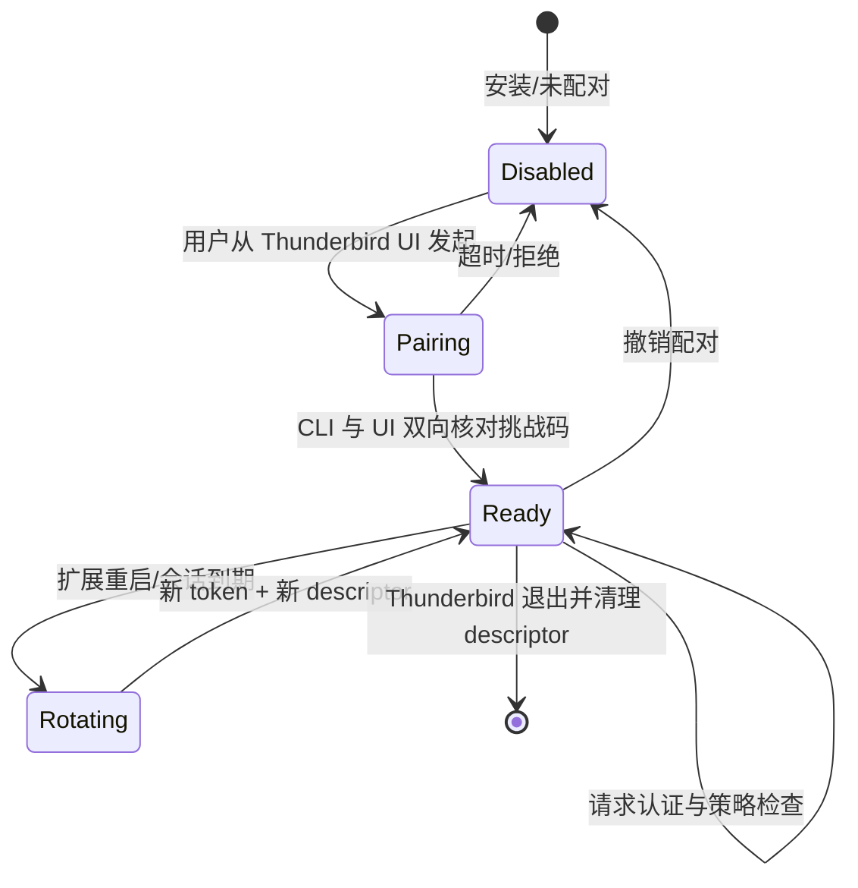
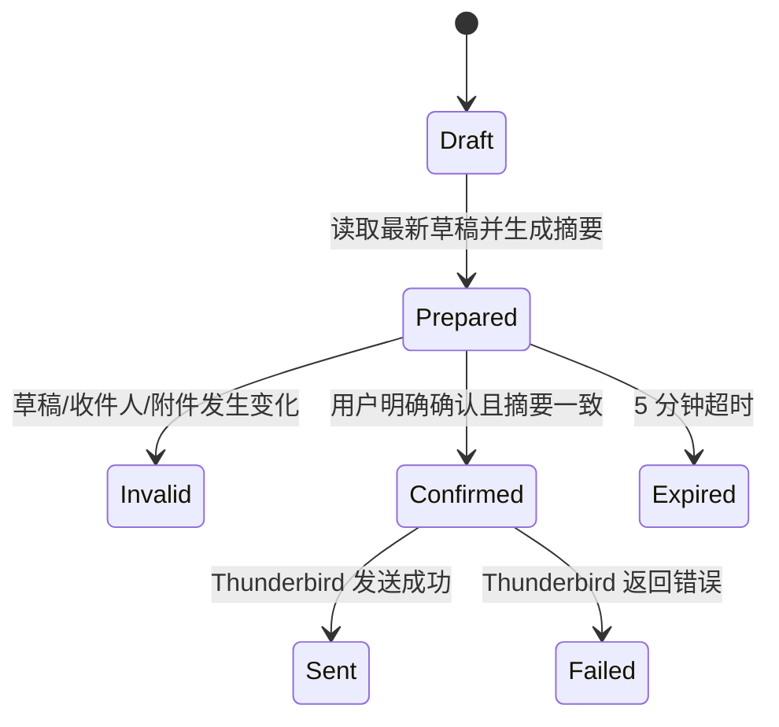

# Thunderbird 扩展设计

## 设计意图

扩展是唯一邮箱权限持有者，也是最终安全裁决点。CLI 即使被错误调用或遭到提示注入，扩展仍必须通过认证、账号作用域、参数 schema、风险等级和确认状态逐层拒绝越权操作。

## Manifest 与权限

目标基线为 Thunderbird 128 ESR 及后续受支持版本，采用 Manifest V3 目标结构。由于本地监听和部分 Thunderbird 特权能力需要 Experiment API/XPCOM，最终 manifest 必须按实际兼容性验证调整；当前 `extension/manifest.json` 只是不会启动服务的占位。

权限按实施阶段拆分：

| 权限 | 用途 | 启用阶段 |
|---|---|---|
| `accountsRead` | 枚举账号和 identity | MVP |
| `messagesRead` | 搜索与读取邮件 | MVP |
| `accountsFolders` | 文件夹枚举与解析 | MVP |
| `messagesMove` | 移动、移入废纸篓、撤销 | Phase 2 |
| `compose` | 草稿与撰写窗口 | Phase 2 |
| Calendar Experiment | 日历读取与后续写入 | Phase 3，独立评审 |

联系人、过滤器、文件夹创建/删除、永久删除、远程 host 权限均不进入初始 manifest。能力未启用时，API 返回 `E_POLICY_DENIED`，不做隐式降级。

## 内部模块

```text
extension/src/
├── background.ts       # 生命周期入口
├── transport/          # loopback server、请求上限、Host/Origin
├── discovery/          # descriptor 原子写入和清理
├── auth/               # session token、配对、nonce、防重放
├── protocol/           # 路由、版本、严格 schema
├── policy/             # 风险、账号 allowlist、确认状态机
├── mail/               # Thunderbird API adapter
├── audit/              # 脱敏事件日志
└── ui/                 # 配对与授权设置页
```

业务模块不得直接读取 HTTP body 或 token；transport 输出经过认证的 typed request，policy 输出授权后的 typed operation，mail adapter 才能调用 Thunderbird API。

## 生命周期



扩展启动时：

1. 读取配对授权元数据，不读取邮箱凭据。
2. 生成 256-bit 随机会话 token 和 instance ID。
3. 选择空闲高位端口并仅绑定 `127.0.0.1`。
4. 以安全权限原子写 descriptor。
5. 启动短期 nonce cache、请求限制和审计轮转。
6. 未配对时仅开放最小 `status` 与 pairing endpoint，且仍需挑战流程。

退出时关闭 server、清空内存 token/nonce、删除自身 descriptor 和临时内容。异常退出留下的文件由下次启动和 CLI stale detection 清理。

## 认证与防重放

- session token 每次启动生成，不落入扩展持久设置。
- descriptor 是 token 的本机传递通道，只允许同一 OS 用户读取。
- token 比较使用 constant-time 方法。
- 每个 authenticated request 还需 timestamp 与 128-bit nonce。
- 接受时间窗口建议 ±30 秒；nonce 在窗口内只允许一次。
- 请求 ID、nonce、token 均不得出现在日志。
- 连续认证失败触发短期速率限制，不改变错误细节。

## 配对持久状态

扩展可持久保存：

- 配对 client 公钥或随机 client ID 的哈希。
- 授权账号 ID 集合。
- 允许能力集合。
- 配对创建/最后使用时间。
- 策略版本。

扩展不得持久保存：

- IMAP/SMTP 密码。
- 邮箱 OAuth token。
- 启动期 session token。
- 邮件正文、附件内容或确认明文。

## 请求验证

每条 route 定义静态 schema：

- 拒绝未知字段。
- 必填、枚举、字符串长度、数组大小、时间范围均有限制。
- object 只读取 own properties；禁止 `__proto__`、`prototype`、`constructor` 等危险键。
- ID/ref 只接受规范格式，不接受原始 folder URI、SQL 或路径。
- 邮箱地址使用语法解析和规范化，不以字符串拼接判断。
- 文件名被视为展示数据，不解释路径分隔符。
- path 输入在 CLI 与扩展双检；扩展优先接收字节流而非任意本机路径。

验证失败不得执行部分业务操作；批量操作默认 all-or-nothing，若 Thunderbird API 无法保证事务，则响应必须逐项报告且禁止自动重试。

## 账号与对象作用域

- 每个请求的账号必须位于配对授权 allowlist。
- message、folder、draft、identity、calendar ref 解析后再次校验所属账号/profile。
- 授权配置损坏或无法读取时失败关闭；只允许最小诊断与重新配对。
- identity 必须来自当前 Thunderbird profile，且属于已授权账号。
- 账号删除、重建或 identity 变化使相关 ref 与发送确认失效。

## 操作策略

| 风险 | 扩展行为 |
|---|---|
| 只读 | 验证配对、能力、账号和输出上限后执行 |
| 可逆 | 记录原状态，生成短期 undo token |
| 外发 | 仅接受已存在草稿；执行 prepare/confirm 两阶段校验 |
| 破坏性 | MVP/Phase 2 直接拒绝；未来需独立策略和 Thunderbird UI 确认 |

扩展不能信任 CLI 传入的 `risk` 标签；风险由 route 的静态元数据决定。

## 外发确认状态机



- prepare 响应必须显示 To/Cc/Bcc、主题、正文短摘要、附件名和大小、发件 identity。
- confirmation ID 绑定草稿 revision、recipient digest、subject digest、附件 digest 和 client pairing。
- confirm 一次性使用；网络未知结果需查询操作状态，不能盲目重发。
- 扩展不提供“新建并发送”单步 endpoint。

## 审计日志

记录：

- 时间、request ID 哈希、client ID 哈希。
- route、风险等级、授权结果。
- profile/账号的不可逆哈希。
- 对象数量、结果类别、耗时。
- 外发 prepare/confirm 的 revision 哈希和状态。

不记录：token、nonce、正文、完整主题、完整邮箱地址、附件内容、原始路径、raw MIME。

日志目录当前用户专有，文件 `0600`，按大小轮转，默认保留 7 天。用户可从扩展 UI 清空日志；诊断导出必须再次脱敏。

## 错误与崩溃安全

- 捕获业务异常并映射为稳定内部错误，HTTP 响应不含堆栈。
- 未处理异常不得使 server 继续处于未知授权状态；关键模块异常后停止监听并删除 descriptor。
- 启动期间先完成策略和账号配置校验，再写 active descriptor。
- connection refresh 仅重写当前实例信息，不覆盖其他实例。
- 健康检查不访问邮件，不泄漏账号详情。

## 当前骨架边界

`extension/src/background.ts` 现在返回明确的 compatibility 状态：不申请邮件权限、不启动服务、能力为空且保持未配对；`protocol.ts` 提供 Host/Origin、session token、timestamp、nonce 与 Ed25519 client 签名的可测试纯逻辑。仍没有 Experiment API、socket、descriptor 写入、邮件 API 或发送能力；真实实现必须先在隔离 profile 中完成兼容性验证与安全审查。
