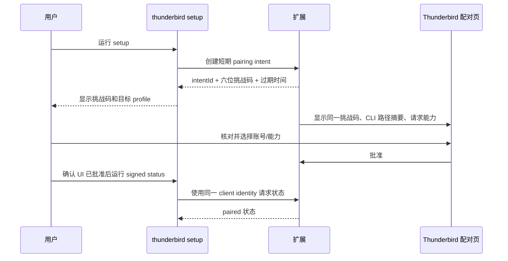

# 认证、配对与多 Profile

## 设计意图

Thunderbird 已配置账号是唯一邮箱身份源；本项目只建立“本机 CLI 是否获准调用此扩展实例”的短期信任。配对不会复制邮箱凭据，也不会让 CLI 接触 IMAP、SMTP 或 OAuth token。

## 身份与凭据边界

| 数据 | 所有者 | CLI 是否可见 |
|---|---|---|
| IMAP/SMTP 密码 | Thunderbird/系统凭据存储 | 否 |
| 邮箱 OAuth token | Thunderbird | 否 |
| 发件 identity | Thunderbird profile | 仅脱敏 ID 与展示信息 |
| 配对授权 | 扩展 | client ID、签名算法、公钥与授权状态 |
| client 私钥 | macOS Keychain（generic password，Ed25519 PKCS#8） | 是；同用户进程亦可读取，故不构成进程间隔离 |
| 启动期 session token | descriptor + CLI 内存 | 是，短期且不持久化 |
| 邮件对象 ref | 扩展 | 是，不透明且绑定实例 |
| 发送 confirmation | 扩展 | 是，短期、一次性、绑定草稿 revision |

CLI 不提供登录邮箱、导入密码、刷新 OAuth 或直接连接 IMAP/SMTP 的命令。

## 首次配对

配对必须同时依赖 Thunderbird UI 与 CLI，避免任一本机进程仅凭发现端口即可永久授权。

要求：

- pairing intent 最长 5 分钟，单次使用。
- 六位码只是人工核对信息，不是 session token；必须有高熵 intent secret 防穷举。
- UI 显示 profile、CLI 可执行文件的规范路径与签名/哈希摘要、请求能力和账号。
- 未经 Thunderbird UI 操作不得完成配对。
- `setup` 创建 intent 后立即输出挑战码，不在首次展示前静默轮询；确认后由用户显式运行带 `--client` 的 `status` 验证 paired 状态。
- CLI identity 是存放在 macOS Keychain 中的 **Ed25519** 私钥。协议固定为 `protocolVersion=1`，**不存在签名算法协商**：`publicKeyAlgorithm: "Ed25519"` 只是一个大小写敏感的**纯断言**字段，用于确认对端声明的密钥类型与本实现唯一支持的类型一致，绝不驱动算法选择，也不存在对应的签名算法 header。配对 body 必须恰好是 `{clientId, publicKeyAlgorithm, publicKeySpkiBase64}` 三键，公钥必须是 60 字符 base64 / 44 字节 DER / 前缀 `302a300506032b6570032100` 的 Ed25519 SPKI。**该 Keychain 条目对同用户进程可读，因此它不提供同用户进程间的隔离，也不证明调用进程身份。**`setup --reconfigure` 在服务端仍 paired 时保留旧 identity 并要求先在 UI 撤销，在服务端已 unpaired 时复用同一 identity 创建新 intent，不执行破坏性的 delete/create 轮换。长期授权事实仍由扩展持有。

## 启动与会话轮换

每次扩展启动：

1. 生成新 `instanceId`、session token、nonce cache。
2. 加载已配对 client 与账号/能力授权。
3. 写入新的实例 descriptor。
4. 首个请求完成 status/协议握手后才执行业务操作。
5. 会话到期、扩展重载、profile 切换或配对撤销后立即失效。

CLI 不缓存 token 到磁盘；进程结束即释放内存。为了减少 descriptor 暴露窗口，可在健康握手后由扩展定时轮换 token，descriptor 原子更新，旧 token 仅保留极短重叠期。

## 重新配对与权限变更

触发条件：

- 用户运行 `setup --reconfigure`。
- 扩展升级导致策略主版本变化。
- CLI 可执行文件路径或签名发生异常变化。
- 授权账号被删除或 profile 迁移。
- 用户从扩展 UI 撤销 client。

重新配对必须显示当前授权与拟变更差异。减少权限可立即生效；扩大账号或能力必须重新由 Thunderbird UI 批准。

## 遗失授权与恢复

| 场景 | 行为 |
|---|---|
| CLI 本地状态丢失 | 旧 client 保持在扩展中但无法证明身份；重新配对，可从 UI 清理旧记录 |
| 扩展设置丢失 | 所有 client 视为未配对；邮箱账号本身不受影响 |
| descriptor 泄漏 | 仅影响当前短期会话；重启扩展或在 UI 中“轮换会话”立即失效 |
| session token 错误 | 不回退到稳定 token；重新发现一次后返回 `E_AUTH` |
| 配对被撤销 | 当前 session 立即关闭，descriptor 删除或重写为未配对状态 |
| profile 复制到另一台机器 | 不继承有效配对；设备绑定信息不匹配时重新配对 |

不设计“找回邮箱密码”或“导出 OAuth token”流程。

## 多 Profile 与多实例

每个运行实例拥有独立 descriptor。CLI 发现顺序：

1. 显式 `--instance`。
2. 显式 `--profile`。
3. 项目/用户配置中的默认 profile 提示。
4. 扫描可信 `instances/` 目录并健康握手。
5. 仅有一个健康且已配对候选时选用。
6. 多个候选时返回 `E_AMBIGUOUS_INSTANCE`。

候选展示仅包含：

- 脱敏 profile label。
- instance ID 短前缀。
- Thunderbird/扩展版本。
- 启动时间。
- 授权能力摘要。

不得展示 token、descriptor 完整路径、完整邮箱地址。默认 profile 只是选择偏好，不能绕过健康、配对和账号检查。

## 多客户端

扩展可允许多个已配对本机 client，但每个 client 分别维护：

- client ID/公钥摘要。
- CLI 路径或发布身份摘要。
- 能力和账号 allowlist。
- 创建、最后使用与撤销时间。
- 可选的速率限制。

外发能力默认不随只读授权自动授予。一个 client 的 confirmation/undo token 不得由另一个 client 使用。

## 账号授权

首次配对默认请求最小只读范围。用户可在 Thunderbird UI 中按账号启用：

- 读取邮件。
- 保存附件。
- 标记/移动/移入废纸篓。
- 创建和更新草稿。
- 外发确认。
- 日历读取/写入。

CLI 的请求不能扩大范围。账号配置无法解析时，扩展失败关闭，并提供不含邮箱详情的修复提示。

## 决策、假设与未决问题

| 类型 | 内容 |
|---|---|
| 已决 | 邮箱凭据和 OAuth token 始终留在 Thunderbird |
| 已决 | 每次扩展启动使用新 session token，不提供 stable token |
| 已决 | 多实例按独立 descriptor 发现，歧义时失败 |
| 已决 | 扩权必须经 Thunderbird UI 明确批准 |
| 假设 | 扩展设置可安全保存 client 授权元数据，但不保存会话秘密 |
| 已决 | paired client 使用 Keychain 中的 Ed25519 私钥对 canonical request 签名；canonical 覆盖 `pairingEpoch` |
| 已决 | `publicKeyAlgorithm` 是纯断言，不参与算法协商；revoke 单调递增独立持久化的 `pairingEpoch`，旧签名立即失效并返回 `E_PAIRING_CHANGED` |
| 已决 | 同 `clientId` 且候选新公钥自签名有效时可替换在途 pending 并换发新 intentId/挑战码；不同 `clientId` 返回 `E_PAIRING_PENDING` |
| 已接受残余风险 | 同一 macOS 用户会话内的恶意进程为明确 out-of-scope（accepted residual risk）；该 Keychain generic password 条目对同用户进程可读，Ed25519 私钥可被同用户导出，故签名不构成进程间隔离，也不证明调用进程身份 |
| 未决 | profile label 的稳定标识和隐私友好的展示方式 |

## 威胁模型与残余风险

同一 macOS 用户会话内的恶意进程是**明确 out-of-scope 的已接受残余风险**；Ed25519 + macOS Keychain **不能**证明调用进程身份（同用户进程可读取该私钥），只能证明请求由持有该私钥的实体产生。仍然真实防御的攻击面包括：网页访问本地回环、descriptor 替换、请求重放、被动 token 泄漏与用户误操作；Phase 2 起邮件正文中的任何指令或确认语句永远无效。UI confirm 的真实 GUI 链路因 Dexter 权限不可用而标记为环境未验证。完整表述见根目录 `README.md` 的同名章节。
