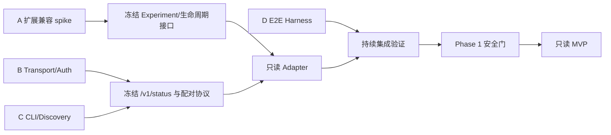

# 开发就绪评估与四人小队拆分

## 评估结论

当前方案已经足够进入 **Phase 1 技术验证与安全底座开发**，但尚不应直接承诺“完整邮件功能开发完成时间”或并行实现外发能力。架构边界、CLI 契约、安全模型和阶段门禁已经明确；真正阻塞完整开发的是 Thunderbird 128+ 的 Manifest V3/Experiment API 可行性、本地 transport 实现选型和 macOS 路径行为三项验证。

**配对身份强度不再是阻塞项，也不是未决项**：已决为 Keychain 中的 Ed25519 私钥对 canonical request 签名（canonical 覆盖 `pairingEpoch`）。其防御目标是重放、descriptor 替换与网页访问回环；**同一 macOS 用户会话内的恶意进程为明确 out-of-scope 的已接受残余风险（accepted residual risk），不是待解除的阻塞**。任何纯用户态方案都无法在该边界内提供隔离，因此不存在“提高身份强度即可解除”的条件。

建议 leader 采用以下准入判断：

| 范围 | 就绪状态 | 结论 |
|---|---|---|
| Phase 1：transport、descriptor、握手与配对原型 | **可启动** | 接口边界和负向验收标准已足够，可由四人小队并行验证 |
| Phase 2：只读邮件 MVP | **有条件就绪** | 等待 Thunderbird API adapter 与 MV3/Experiment 可行性结论 |
| Phase 3：可逆操作与附件保存 | **未就绪** | 依赖只读对象引用、幂等、附件 transport 和撤销语义实测 |
| Phase 4：草稿 | **未就绪** | 依赖 identity、compose API、附件路径/流式上传验证 |
| Phase 5：真实外发 | **禁止提前开发** | 必须在前四阶段安全门全部通过后单独评审 |
| Phase 6：日历与 watch | **未就绪** | API 与 recurrence 语义尚未验证，不在首轮开发范围 |

## 开发就绪清单

### 已完成：可以直接作为开发输入

- [x] 明确目标与非目标：专用 CLI + Thunderbird 扩展 + 按需 Skill；不注册 MCP。
- [x] 明确禁止面：无 JSON-RPC、stdio server、动态工具发现、listen-all、stable token。
- [x] 定义组件信任边界：Skill、CLI、transport、扩展 policy、Thunderbird API 分层。
- [x] 选定 MVP transport 方向：`127.0.0.1` HTTP/1.1 + 每实例 descriptor。
- [x] 定义 descriptor 字段、权限、原子写入、stale detection 和多实例消歧原则。
- [x] 定义 session token、Host/Origin、timestamp、nonce、版本握手和认证顺序。
- [x] 定义稳定 CLI 命令树、风险等级、JSON envelope、错误码和退出码。
- [x] 定义账号/identity 归属：Thunderbird 是唯一邮箱身份源，CLI 不接触邮箱凭据。
- [x] 定义只读、可逆、外发、破坏性四级策略与双层校验要求。
- [x] 定义草稿优先、外发 prepare/confirm、revision 绑定和禁止自动重试。
- [x] 定义 prompt injection、附件、日志脱敏、临时文件和批量阈值基线。
- [x] 定义 PR 拆分、威胁模型、测试矩阵、E2E、发布和回滚要求。
- [x] 建立可编译 CLI/扩展骨架、Skill 和契约测试；当前不会访问邮件。

### Phase 1 开工前必须由 leader 确认

- [ ] 接受“先做兼容性 spike，再冻结扩展结构”的开发顺序。
- [ ] 确认初始兼容基线：Thunderbird 128 ESR + 当前 ESR + 当前 release。
- [ ] 确认 Phase 1 只交付 mock/status/pairing，不实现任何邮件读取或写入。
- [ ] 指定最终代码评审责任人，特别是 transport/auth/policy 的跨模块审查人。
- [ ] 确认测试只能使用隔离 Thunderbird profile 与 fixture，不使用个人真实邮箱。
- [ ] 确认外发能力保持 feature-disabled，直到 Phase 5 独立批准。

### 进入只读 MVP 前必须完成

- [ ] Thunderbird 128+ 的 MV3 background 与 Experiment API 最小扩展实测通过。
- [ ] loopback server 能稳定启动、停止、清理 descriptor，并通过 Host/Origin/重放负向测试。
- [ ] 多 profile/多实例不会覆盖 descriptor 或误连。
- [ ] 配对流程在 Thunderbird UI 中可核对 client、profile、账号和能力。
- [ ] 协议主版本不兼容时可稳定失败，不能猜测降级。
- [ ] MailExtension/Experiment adapter 能只读列出账号、文件夹和 fixture 邮件。
- [ ] CI 可以运行 CLI contract、transport integration 和至少一个 Thunderbird E2E 环境。

### 进入可逆、草稿与外发前必须完成

- [ ] opaque ref 在重启、移动、账号变化后的失效语义经过实测。
- [ ] 写操作的 operation status、幂等键和部分失败模型冻结。
- [ ] undo token 能恢复移动/废纸篓操作，且跨 client、过期和重放均失败。
- [ ] 附件使用流式上传或受控临时文件的方案通过 macOS/TCC/沙箱测试。
- [ ] identity 与 Drafts 目标在 IMAP、本地文件夹和 OAuth 账号下验证。
- [ ] compose/draft revision 可可靠检测收件人、正文和附件变化。
- [ ] 本地捕获 SMTP E2E 能证明未知网络结果不会重复发送。
- [ ] 外发威胁模型和人工 UX 评审通过，才允许启用 send endpoint。
- [ ] Phase 2 起必须实现 prompt injection 防御：邮件正文中的指令与确认语句一律无效。
- [ ] UI confirm → receipt → signed status 真实 GUI 链路独立复验（当前因 Dexter 权限不可用而**环境未验证**）。

## 未决决策总表

以下项目是当前所有设计文档中的未决项汇总。未列在此表的已决架构不应由实现者自行改写。

| ID | 决策 | 建议默认 | 决策截止点 | 决策证据/产物 | Owner |
|---|---|---|---|---|---|
| D-01 | Thunderbird MV3 background 与 Experiment API 的最终 manifest 形态 | 以 128 ESR 最小可运行扩展实测为准 | Phase 1 第一个 PR | 兼容性 spike、版本矩阵 | 扩展负责人 |
| D-02 | loopback server 复用 Mozilla `httpd.sys.mjs` 还是自建最小 server | 先验证 `httpd.sys.mjs`；若攻击面/许可证成本不可接受再自建 | transport PR 前 | API/许可证/压力/关闭行为对比 | Transport 负责人 + 安全评审 |
| D-03 | 是否在 descriptor token 之外增加 client 公钥签名 | **已决**：增加 Ed25519 签名，canonical 覆盖 `pairingEpoch` | 已冻结 | 结论：签名防御的是重放、descriptor 替换与网页访问；**同用户恶意进程为 out-of-scope 已接受残余风险**，签名不证明调用进程身份 | Auth 负责人 |
| D-04 | macOS descriptor 根目录 | 优先当前用户专有 runtime/temp 根，所有候选执行 owner/权限检查 | discovery PR 前 | Terminal/GUI/多 profile/TCC 测试 | CLI/Discovery 负责人 |
| D-05 | session token 是否运行中轮换 | MVP 可只在启动时轮换；若 descriptor 暴露窗口不可接受再增加周期轮换 | Phase 1 安全评审 | 重连和竞态测试 | Auth 负责人 |
| D-06 | 附件传输采用 HTTP 流式 multipart 还是受控临时文件 | 优先流式上传；临时文件只作受限 fallback | Phase 3 前 | 沙箱可见性、性能、路径攻击测试 | CLI + 扩展负责人 |
| D-07 | opaque message/folder ref 的编码与持久性 | 绑定 instance/profile，默认短期失效，不暴露数据库键 | 只读 API contract 冻结前 | 重启/移动/同步 E2E | Mail adapter 负责人 |
| D-08 | 写操作部分失败与幂等结果模型 | 单项结果 + operation ID；不得静默重试 | Phase 3 前 | IMAP 异步行为与故障注入测试 | Policy 负责人 |
| D-09 | CLI 发布身份变化后的配对迁移 | 路径/签名异常变化要求重新批准，版本升级可显示差异迁移 | 正式发布前 | 签名与升级原型 | Auth + Release 负责人 |
| D-10 | Skill 安装采用复制、symlink 还是 installer | 仓库保留发布源；发布时优先显式 installer/copy，避免跨机 symlink | 发布前 | Claude Code 项目级 Skill 安装测试 | CLI/Release 负责人 |
| D-11 | 外发能力正式发布时是否默认关闭 | 默认关闭，由扩展 UI 单独启用 | Phase 5 发布评审 | 用户测试和威胁评审 | Leader + 安全评审 |
| D-12 | 日历 recurrence 与邀请更新语义 | 不纳入首轮；按整个 series/单实例能力分开设计 | Phase 6 前 | Thunderbird 跨版本 E2E | Calendar 负责人 |
| D-13 | `watch` 的进程生命周期和事件可靠性 | 最长 15 分钟、JSONL、有限事件 allowlist，不做 server | Phase 6 前 | 中断、背压、重连测试 | CLI 负责人 |

## 实现阻塞项

### P0：阻塞 Phase 1 或架构冻结

| 阻塞项 | 影响 | 解除条件 |
|---|---|---|
| Thunderbird 128+ MV3/Experiment API 未实测 | 无法确认 background 生命周期、本地 server 和签名扩展形态 | 产出最小 XPI，在目标版本启动/停止并记录 API 差异 |
| 本地 server 实现未选定 | transport、安全审查、许可证和构建方式无法冻结 | 完成 `httpd.sys.mjs` 与最小自建 server 的对比 spike |
| macOS descriptor 路径未实测 | CLI 可能无法从不同启动上下文发现扩展 | 在 Terminal、Thunderbird GUI、双 profile 下验证候选目录 |

> **已从 P0 移除：client 身份强度**。该项已决为 Keychain Ed25519 签名 + canonical 覆盖 `pairingEpoch`，并已实现与测试。
> 同一 macOS 用户会话内的恶意进程属于**明确 out-of-scope 的已接受残余风险**，不是可解除的阻塞项 ——
> 该会话被攻陷时攻击者可直接读取 Keychain 条目、0600 descriptor 与 session token，或直接以用户身份运行 CLI。
> **不得声称 Ed25519 + Keychain 证明调用进程身份**：签名只证明请求由持有该私钥的实体产生。

### P1：阻塞只读 MVP

| 阻塞项 | 影响 | 解除条件 |
|---|---|---|
| Thunderbird adapter API 未定 | accounts/folders/messages 的稳定 ref 和错误语义无法实现 | fixture profile 上完成只读 adapter spike |
| HTML/MIME 转换库与策略未选 | 正文输出和 prompt injection 面不稳定 | 选定本地净化/转换路径并建立恶意 fixture 测试 |
| E2E profile 自动化未建立 | 无法证明跨版本行为 | 可重复创建、启动、注入 fixture、销毁测试 profile |
| CI Thunderbird 环境未定 | 真实兼容性只能人工验证 | 明确至少一个自动 E2E runner 和发布前人工矩阵 |

### P2：阻塞写入与外发

| 阻塞项 | 影响 | 解除条件 |
|---|---|---|
| IMAP 写入异步/部分失败语义未验证 | move/trash/undo 可能产生错误状态 | 故障注入和跨账号测试冻结 operation model |
| 附件 transport 未定 | 路径越权、沙箱不可见或内存过载 | D-06 决策和安全/性能测试通过 |
| compose revision 可靠性未验证 | 外发确认可能绑定错误内容 | 对收件人、正文、附件变化进行 revision E2E |
| 本地 SMTP 捕获环境未建立 | 无法验证 exactly-once 发送行为 | 建立隔离 SMTP sink 和未知结果测试 |

## 四人小队模块与任务边界

建议四人同时从 Phase 1 开始，但只在约定接口上协作。每人拥有独立可测试产物，避免多人共同修改一个大文件。

| 角色 | 模块所有权 | 首轮任务 | 明确不负责 |
|---|---|---|---|
| A. 扩展兼容与 Thunderbird Adapter | `extension/manifest*`、Experiment API、生命周期、未来 `mail/` adapter | 完成 D-01 spike；验证账号/文件夹/fixture 邮件只读 API；输出兼容矩阵 | loopback 认证、CLI parser、Skill |
| B. Transport / Auth / Policy | `extension/src/transport/`、`discovery/`、`auth/`、`protocol/`、`policy/`、`audit/` | 完成 D-02/D-03；实现仅 status/pairing 的安全 server 原型及负向测试 | 真实邮件业务、CLI UX、Skill 文案 |
| C. CLI / Discovery / Contract | `src/`、CLI 测试、descriptor 发现、版本握手、JSON 输出 | 完成 D-04；实现 doctor/setup/status 客户端、严格 parser、mock integration | Thunderbird 特权 API、外发业务 |
| D. Skill / E2E / Release Harness | `skill/`、E2E fixture/profile、测试编排、构建和产物验证 | 建立隔离 profile、Skill 场景测试、非 MCP 扫描、发布前验证框架 | transport 安全实现、真实发送 |

### 模块依赖图

### 首轮可直接拆分的任务包

| 包 | 负责人 | 输入 | 输出 | 验收 |
|---|---|---|---|---|
| W1 Thunderbird 兼容性 spike | A | `manifest.json` 骨架、D-01 | 最小扩展、128 ESR/当前版本结果、API 差异表 | 能可靠启动/停止；没有邮件写权限 |
| W2 Server 选型 spike | B | transport 安全要求、D-02 | 两种 server 方案对比、最小 status endpoint、许可证结论 | 只绑定 `127.0.0.1`，可完全关闭 |
| W3 Descriptor/发现原型 | C | descriptor schema、D-04 | 安全目录检测、多实例发现、stale/歧义测试 | owner/权限/symlink/多实例负向测试通过 |
| W4 E2E profile harness | D | 测试矩阵 | 可重复的测试 profile、fixture 注入和清理命令 | 不依赖个人邮箱；失败后无残留 token/进程 |
| W5 配对与 client 身份 | B 主、C 配合 | D-03、UI 流程 | pairing contract、挑战码 UI 原型、CLI setup mock | 未经 Thunderbird UI 无法配对 |
| W6 版本握手与 doctor | C 主、B 配合 | `/v1/status` contract | CLI status/doctor、版本不兼容错误 | 主版本不兼容稳定失败 |
| W7 只读 adapter spike | A | fixture profile、MailExtension API | accounts/folders/message fixture adapter | 账号 allowlist 与跨账号拒绝测试 |
| W8 集成与非 MCP 验收 | D | W1-W7 产物 | integration suite、HTML 报告、source scan | Phase 1 清单全部有机器证据 |

W1-W4 可并行启动；W5 依赖 W2/W3 的最小接口；W6 依赖 W2；W7 依赖 W1 与 W4；W8 持续集成并最终收口。

## 跨模块接口冻结规则

为减少四人并行冲突，先冻结以下契约，再实现内部细节：

1. `InstanceDescriptor` 和 `/v1/status` 的字段、版本和错误语义。
2. transport 传给 protocol 层的 authenticated request 类型。
3. protocol 传给 policy 层的 route ID、client ID、account scope 和 request context。
4. Thunderbird adapter 的 typed interface，不把 WebExtension 原始对象泄漏给 policy/CLI。
5. CLI envelope、错误码和退出码映射。
6. 测试 fixture 与 operation ID/ref 的生成规则。

任何跨模块契约变更必须：更新类型与文档、增加兼容/迁移说明、由受影响模块 owner 共同评审。实现者不得为方便而新增通用 `callTool`、动态分发或 MCP 兼容入口。

## Leader 的开发准入门

leader 可在下列条件全部满足后宣布进入“完整开发”：

- [ ] D-01 至 D-05 已做出明确决策并记录证据（D-03 client 身份强度已决并冻结，见上）。
- [ ] P0 阻塞项全部解除（同 UID 进程隔离**不在**其中：已记为 out-of-scope 的接受残余风险，不作为解除条件）。
- [ ] W1-W6 通过负向安全测试。
- [ ] 四个模块 owner 与跨模块评审人已指定。
- [ ] CI/E2E 不使用个人真实邮箱且可重复运行。
- [ ] Phase 1 只含 status/pairing，不夹带邮件写入。
- [ ] 外发 endpoint、权限和 UI 仍保持禁用。

在此之前，允许开展的是有限 spike 和安全底座原型；不得把设计中的后续命令批量实现为可操作真实邮箱的功能。

## 威胁模型与残余风险

同一 macOS 用户会话内的恶意进程是**明确 out-of-scope 的已接受残余风险**；Ed25519 + macOS Keychain **不能**证明调用进程身份（同用户进程可读取该私钥），只能证明请求由持有该私钥的实体产生。仍然真实防御的攻击面包括：网页访问本地回环、descriptor 替换、请求重放、被动 token 泄漏与用户误操作；Phase 2 起邮件正文中的任何指令或确认语句永远无效。UI confirm 的真实 GUI 链路因 Dexter 权限不可用而标记为环境未验证。完整表述见根目录 `README.md` 的同名章节。
